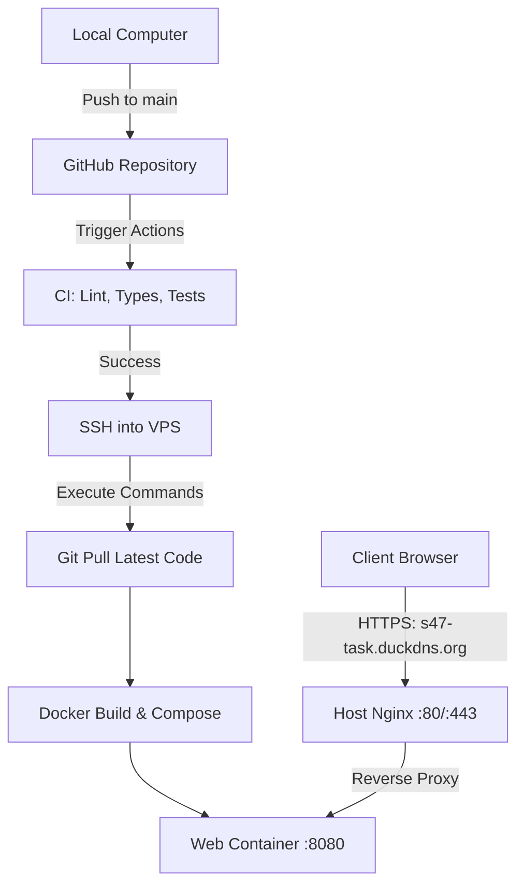

# S47 Task Tracker: End-to-End Deployment & CD Automation Journey

This document records the step-by-step journey of deploying the **S47 Task Tracker Monorepo** on a Hostinger VPS and automating its continuous deployment (CD) via GitHub Actions.

---

## 🗺️ Architectural Target

Our goal was to set up a robust, zero-downtime, fully automated deployment pipeline:


---

## 🛠️ The Journey: Challenges, Diagnostics, and Resolutions

Here is the log of each challenge we faced during the deployment process, how we diagnosed it, and the final solution.

### Challenge 1: Unprotected SSH Key Permissions on VPS
* **Symptom**: Attempting to clone the repository on the VPS via SSH failed with `git@github.com: Permission denied (publickey)` and a warning: `Permissions 0755 for '/home/deploy/.ssh/tracker_deploy' are too open. This private key will be ignored.`
* **Diagnostic**: SSH security standards reject private keys that are readable by other users. Because the files in `/home/deploy/.ssh/` had open `755` permissions, SSH ignored them.
* **Resolution**: We locked down the folder and key files to standard secure Unix permissions:
  ```bash
  chmod 700 /home/deploy/.ssh
  chmod 600 /home/deploy/.ssh/tracker_deploy
  chmod 600 /home/deploy/.ssh/github_actions_deploy
  chmod 600 /home/deploy/.ssh/gh_deploy
  chmod 600 /home/deploy/.ssh/authorized_keys
  chmod 600 /home/deploy/.ssh/config
  ```
  After restricting the permissions, the VPS successfully cloned the repository into `/var/www/task-tracker-s47`.

---

### Challenge 2: Seed Script Missing in Production Image
* **Symptom**: Running the database seed command inside the running API container failed with:
  `Error: Cannot find module '/repo/apps/api/dist/database/seed.js'`
* **Diagnostic**: In the backend API's [tsconfig.build.json](file:///c:/Users/soumi/Desktop/task-tracker-s47/apps/api/tsconfig.build.json), the compiler was configured to exclude `src/database/seed.ts` from compilation. Because our production Dockerfile only copies the compiled `dist/` directory into the runtime stage, the seed script was completely absent from the image.
* **Resolution**: We removed `"src/database/seed.ts"` from the TS compiler exclusion list in `tsconfig.build.json`. Rebuilding the API container successfully compiled and included `dist/database/seed.js`.

---

### Challenge 3: Missing `dotenv` Dependency in Production Mode
* **Symptom**: The compiled seed script failed with:
  `Error: Cannot find module 'dotenv'`
* **Diagnostic**: The seed script imports `dotenv` to parse settings. However, in `package.json`, `dotenv` was declared under `devDependencies`. Because the Docker build file runs `pnpm install --prod` to keep the production image lightweight, `devDependencies` (including `dotenv`) were not installed in the container runner.
* **Resolution**: We moved `dotenv` to production `dependencies` in the backend [package.json](file:///c:/Users/soumi/Desktop/task-tracker-s47/apps/api/package.json), updated `pnpm-lock.yaml`, and rebuilt the image. The seed script ran successfully:
  ```
  ✓ Seeded admin: admin@example.com (password from SEED_ADMIN_PASSWORD)
  ```

---

### Challenge 4: GitHub Actions SSH Timeout (Firewall Block)
* **Symptom**: The CD workflow failed on the `deploy` job with `2026/07/08 13:10:01 dial tcp ***:***: i/o timeout`.
* **Diagnostic**: An `i/o timeout` indicates that incoming SSH requests to port `22` (or the SSH port) on the VPS were being dropped by a firewall.
* **Resolution**:
  1. We configured the server's Uncomplicated Firewall (`ufw`) to explicitly allow traffic on the SSH port.
  2. We configured the Hostinger control panel firewall rules to permit incoming connections.
  3. We authorized the `github_actions_deploy.pub` key by appending it to `authorized_keys`.
  Re-running the job immediately resulted in a successful connection and deployment.

---

### Challenge 5: Reverse Proxy Port Conflict (Nginx vs. Caddy)
* **Symptom**: Accessing `https://s47-task.duckdns.org` failed with `NET::ERR_CERT_COMMON_NAME_INVALID` and Caddy failed to start on the VPS with `listening on :443: listen tcp ... address already in use`.
* **Diagnostic**: Running `sudo ss -tulpn` showed that the host was already running a master **Nginx** server on port `80` and `443` to route traffic for other live products on the VPS. 
* **Resolution**: We stopped and disabled Caddy, and instead integrated our new application directly into the existing Nginx ecosystem by creating a site block in `/etc/nginx/sites-available/s47-task.duckdns.org` pointing to `http://127.0.0.1:8080`. We then ran Certbot on the host:
  ```bash
  sudo certbot --nginx -d s47-task.duckdns.org
  ```
  Certbot successfully provisioned the SSL certificate and automatically generated the redirect from HTTP to HTTPS.

---

## 📋 The Final End-to-End Pipeline Summary

Now, the entire pipeline is secure and self-sustaining:

1. **You push to GitHub**: Pushing code to `main` triggers a complete suite of automated checks.
2. **GitHub runs CI**: Checks formatting, typechecks TypeScript across the monorepo, runs migrations, verifies unit tests, and conducts an e2e smoke test.
3. **Deployment**: If tests pass, GitHub Actions connects to the VPS, pulls the updated codebase, and runs a zero-downtime rebuild using `docker compose -f docker-compose.prod.yml up -d --build`.
4. **Proxy Routing & Security**: The host's Nginx reverse-proxies `https://s47-task.duckdns.org` requests securely to the local Docker container on port `8080`, preserving secure JWT login cookies.
